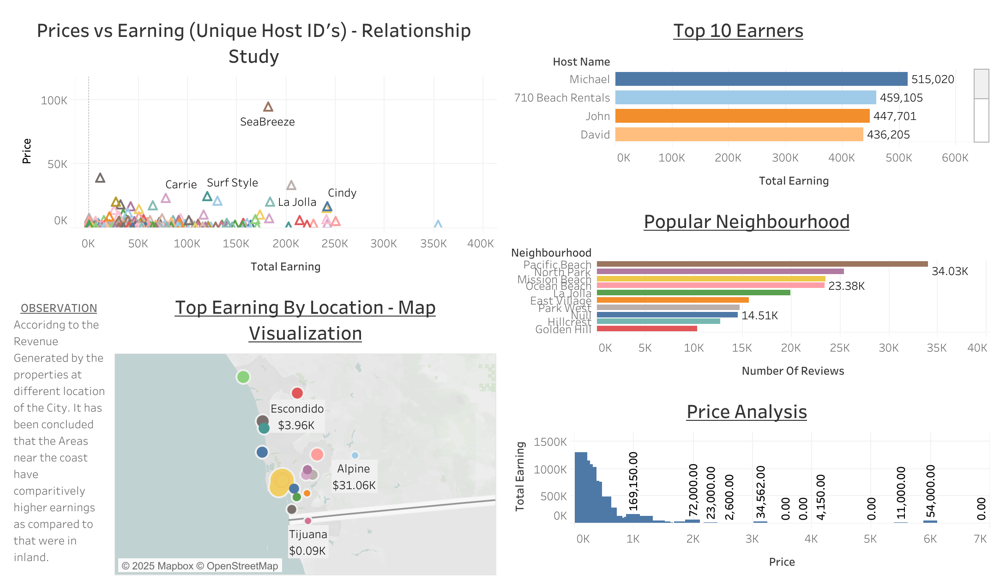

# Project StayCatin 

StayCatin.com is an online platform that lets you book a property on a particular date as per the requirement (similar to AirBnb)

### Objectives :
#### A. Present a Dashboard that showcases:

    1. Top 10 Earners.
    2. Movement of the price and earning of the stay.
    3. Location getting more earnings.
    4. Relation between price and reviews.
        
#### B. Create a StoryBoard with the Insights 

### **DASHBOARD**

Or click here to view the interactive dashboard: [View Dashboard](https://public.tableau.com/app/profile/anuj.singh1169/viz/Dashboard_Anujsingh_StayCating_dataset/Dashboard_AnujSIngh)

### **STORYBOARD**

Scroll to the left and right to get the complete interactive Storyboard: [View Storyboard](https://public.tableau.com/app/profile/anuj.singh1169/viz/Story_AnujSingh_StayCatin_Project/Story_AnujSingh)

### **INSIGHTS FROM STORYBOARD**

#### **1. Top 10 Earners**
   
| Host Name         | Total Earnings |
|------------------|----------------|
| Michael           | $515,020       |
| 710 Beach Rentals | $459,105       |
| John              | $447,701       |
| David             | $436,205       |
| Josh              | $368,593       |
| Beach Cliff       | $354,400       |
| Joseph            | $286,855       |
| Richard           | $272,943       |
| Rebecca           | $270,228       |
| Ed                | $268,600       |

#### **2. Most Popular Locations / Neghbourhood**

| Neighbourhood         | Total Earnings |
|------------------|----------------|
| Pacific Beach           | $34.03 K       |
| North Park | $459,105       |
| Mission Beach              | $25.39 K       |
| Ocean Beach             | $23.53 K       |
| La Jolla              | $19.95 K       |
| East Village       | $15.66 K       |
| Park West            | $14.69 K       |
| Null           | $14.51 K       |
| Hillcrest           | $12.71 K       |
| Golden Hill               | $10.36 K       |

#### **3. House Price Pattern Behaviour and Total Earnings**

THE TOTAL EARNINGS ARE PROPORTIONAL TO THE INVERSE OF THE PROPERTY RENTAL PRICES : In the price analysis the histogram plot between the total earnings and prices of the accomodation showcases a right-skewed plot.   

Almost all location showases similar pattern where maximum number of reviews belongs to the listings which lies in a specific price range of a given interval. As a ripple effect it presents two ossible scenarios :

A. Majority of the population, preffered affordable and convinient options regarding their stay. Hence, the booking frequency for the high priced acomodations was considerably lower than the affordable and convinient accomodations. Therefore, they have less number of reviews as well, in contrary affordable and convinient accomodation has more reviews. However, there is limitations, as we cant conclude frequency of the bookings over the registered listing as the data were insufficient.

B. In majority of the cases, upper middle class and higher cass income group opts the convinence alongside luxury at higher prices. In adition, they also prefer to be least bothered about posting the reviews in the public forums that can be a major reason for less number of reviews for the high prices acomodations. 

#### **4. Earning by Location**

It is evident from the sized based bubble plot over the prices of accomodation in the neighbourhood is more concentrated towards the coast as compared to inland. It infers that the areas near the cost have comparitively higher earnings as compared to those on inlands.
